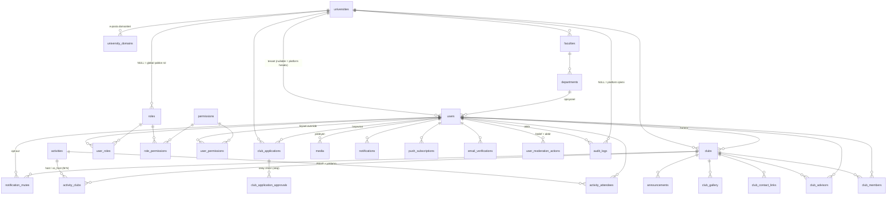

# Veri Modeli

`src/db/schema.ts` tek doğruluk kaynağıdır; bu doküman onu **okunabilir** kılar:
tablolar ne işe yarar, tenant'a nasıl bağlanır, hangi kararlar bilinçlidir.

> Şema değiştiğinde bu dosya da değişmelidir. Kolon kolon bir kopya tutmuyoruz
> (kopya sapar) — burada **amaç, ilişki ve karar** yazılıdır, ayrıntı koddadır.

İlgili: [architecture.md](../architecture/overview.md) · [adr/](../adr/) ·
[schema-product.md](../planning/schema-product.md) · [kvkk.md](../compliance/kvkk.md)

---

## Genel görünüm

---

## Tenant'a bağlanma biçimleri

Her tablo tenant'a aynı şekilde bağlanmaz; üç kalıp var:

| Kalıp | Tablolar | Anlamı |
|---|---|---|
| **Doğrudan `university_id`** | `users`, `clubs`, `faculties`, `roles`, `club_applications`, `audit_logs`, `university_domains` | Satır bir tenant'a aittir (bazılarında NULL = platform seviyesi) |
| **Bileşik FK ile kilitli `university_id`** | `club_members`, `club_advisors`, `club_gallery`, `announcements` | Satırın tenant'ı **hem kulübün hem kullanıcının** tenant'ıyla eşit olmaya DB tarafından zorlanır (bkz. [ADR 0006](../adr/0006-composite-fk-cross-tenant-lock.md)) |
| **Dolaylı** | `departments` (→ faculty), `club_contact_links` (→ club), `notifications`/`notification_mutes`/`push_subscriptions`/`email_verifications` (→ user), `role_permissions`/`user_roles`/`user_permissions`, `club_application_approvals` | Tenant üst kayıttan türetilir; tekrar tutmak sapma riski yaratırdı |

---

## Tablolar

### Kiracı (tenant) hiyerarşisi

| Tablo | Ne tutar | Notlar |
|---|---|---|
| `universities` | Satılan birim | Soft delete var. `status`: `trial` / `active` / `past_due` / `suspended` (varsayılan `active`). `tenant_settings` sapmaları (C1). C2 profil: `timezone` (IANA, varsayılan `Europe/Istanbul`), `defaultLocale` (`tr`/`en`, varsayılan `tr`), `logoUrl`, `primaryColor` (nullable) |
| `university_domains` | Bir üniversitenin e-posta domainleri, `student`/`staff` etiketiyle | Kayıt akışı tenant'ı VE rolü buradan çıkarır ([ADR 0007](../adr/0007-email-domain-tenant-inference.md)). `domain = lower(domain)` CHECK'i var |
| `faculties` → `departments` | Akademik yapı | `departments`'ta bilinçli olarak `university_id` **yok**: fakülte zinciriyle ulaşılır |
| `tenant_settings` | Tenant başına ayar sapmaları | Seyrek model: varsayılanlar kodda (`tenant-settings.catalog.ts`). `key` varchar(64), `value` jsonb. UNIQUE `(university_id, key)`. FK: `university_id` CASCADE, `updated_by` SET NULL |

### Kimlik ve yetki

| Tablo | Ne tutar | Notlar |
|---|---|---|
| `users` | Hesaplar | `university_id` **nullable** = platform hesabı (tenant'sız çalışan). E-posta tenant başına tekil + `email = lower(email)` CHECK. `deleted_at` = anonimleştirilmiş (bkz. [KVKK.md](../compliance/kvkk.md)) |
| `roles` | Rol kataloğu | `university_id` NULL = global şablon. `rank` = rütbe; yükseltme koruması buna bakar. Ad tekilliği hem tenant içi hem global için ayrı index'lerle korunur |
| `permissions` | `resource.action` anahtarları | `key` global tekil. Katalog kodda (`*.permissions.ts`) ama **kapalı küme değil** — runtime'da yeni anahtar eklenebilir |
| `role_permissions`, `user_roles` | Bağ tabloları | Bileşik PK |
| `user_permissions` | Kişiye özel izin/yasak | `granted=false` rolden geleni **iptal eder** — deny kazanır |
| `email_verifications` | Tek kullanımlık doğrulama token'ı | Token'ın **SHA-256 özeti** saklanır, düz hali yalnızca maildeki linkte yaşar |

### Kulüpler

| Tablo | Ne tutar | Notlar |
|---|---|---|
| `clubs` | Kulüp | Slug tenant içinde tekil. `(id, university_id)` tekilliği bileşik FK'lerin hedefi |
| `club_members` | Üyelik + kulüp içi rol (`member`/`officer`/`president`) | Global RBAC'tan **bağımsız** ikinci katman. `left_at` = ayrıldı (satır silinmez). PK `(club_id, user_id)` olduğu için **yalnızca son ayrılış** saklanır — tam tarihçe dönem kavramıyla gelecek (3.3) |
| `club_advisors` | Danışman hocalar (çoklu) | Bileşik FK gereği danışman **aynı üniversiteden** olmak zorunda |
| `club_contact_links` | Sosyal medya/iletişim | `platform` varchar + kod tarafı katalog — yeni platform migration istemez |
| `club_gallery` | Görseller | Kulüp tarafı tenant-kilitli; **yükleyen** tarafı bilinçli serbest |
| `announcements` | Kulüp duyuruları | `status` (`draft`/`published`), `publishedAt`, `pinned` (kulüp başına ≤3), `visibility` (`university`/`members` — etkinlik enum'ları). Denormalize `university_id` bileşik FK ile kilitli |

### Başvuru ve onay

| Tablo | Ne tutar | Notlar |
|---|---|---|
| `club_applications` | Kulüp kurma başvurusu | Başvuran, başvurduğu tenant'ın kullanıcısı olmak zorunda (bileşik FK) |
| `club_application_approvals` | Onay zincirinin **her adımı ayrı satır** (`step`) | Bugün yalnızca step 1 (danışman) kullanılıyor; ikinci onay makamı eklemek şema değişikliği DEĞİL, satır eklemektir. `note` = karar gerekçesi, reddederken zorunlu |

### Etkinlikler ve medya

| Tablo | Ne tutar | Notlar |
|---|---|---|
| `activities` | Kulüp etkinlikleri | Kulüp ve tenant burada **tutulmaz** — `activity_clubs` üzerinden türetilir. Böylece iki kulüp (ve iki üniversite) aynı etkinliği paylaşabilir. `starts_at`/`ends_at` **timestamptz** |
| `activity_clubs` | Etkinlik ↔ kulüp (M:N) | `host` / `co_host`; etkinlik başına en fazla bir `host` (kısmi tekillik index'i). Davet akışı: `invited` → `accepted` |
| `activity_attendees` | RSVP + yoklama | Kulüpten bağımsız, kişisel. `checked_in_at` = gerçekten geldi (RSVP ≠ katılım) |
| `media` | Yüklenen dosyaların METAsı | Dosyanın kendisi `core/storage` adaptöründe (disk/S3). Mevcut `*Url` alanları hâlâ düz URL taşır — bu tablo sahiplik ve boyut kaydıdır |

> **Bu tablolar tenant kilidi TAŞIMIYOR.** `activity_clubs`/`activity_attendees`
> bileşik FK ile korunmuyor ve FK'lerinde `onDelete` yok — yani Tier 0.4 ve 1.1
> kuralları bu dört tabloya henüz uygulanmadı. Sebebi tasarımsal: etkinliğin
> tenant'ı türetilmiş olduğu için (ve üniversitelerarası turnuva bilinçli olarak
> destekleniyor) kilit deseni birebir kopyalanamaz, ayrıca düşünülmeli.
> Yol haritasına eklendi.

### Bildirim, denetim, moderasyon

| Tablo | Ne tutar | Notlar |
|---|---|---|
| `notifications` | Kalıcı bildirimler | `type` varchar + kod kataloğu. Okunmamışlar için kısmi index |
| `notification_mutes` | Seyrek opt-out susturmalar | Varsayılan her şey açık; satır = sapma. `UNIQUE NULLS NOT DISTINCT (user_id, type, club_id)` |
| `push_subscriptions` | Web Push abonelikleri | `endpoint` tekil = cihaz kimliği |
| `audit_logs` | **Append-only** denetim izi | `guard()` otomatik yazar; reddedilen denemeler (403) de düşer. Yazma/silme endpoint'i **yok**. FK'ler `restrict` |
| `user_moderation_actions` | **Append-only** moderasyon geçmişi | `users.status` anlık durumu, bu tablo tarihçeyi tutar |

---

## Şema genelinde geçerli kurallar

Bunlar tek tek tabloların değil, **şemanın** kurallarıdır; yeni tablo eklerken uyulmalı:

1. **Zaman kolonları her zaman `timestamptz`** ve `core/db/base.entity.ts`'teki
   `timestamps`'ten gelir. Yerel bir kopya tanımlanmaz.
2. **Her FK'de açık `onDelete`** — `cascade` (sahiplik), `restrict` (kayıt/denetim),
   `set null` (opsiyonel bağ). Politikasız FK bir gözden kaçmadır, varsayılan değil.
3. **Append-only tablolarda `updated_at` yoktur** — satır güncellenmiyorsa kolon yalan söyler.
4. **Sık büyüyen katalog = `varchar` + kodda `as const` katalog**, `pgEnum` değil
   (`notifications.type`, `audit_logs.action`, `club_contact_links.platform`).
   Nadiren değişen kapalı kümeler `pgEnum` kalır (`user_status`, `club_status`).
5. **Harfe duyarsız eşleşmesi gereken alanlar** (`users.email`,
   `university_domains.domain`) zod'da küçük harfe indirgenir **ve** DB'de
   `= lower(...)` CHECK ile sabitlenir.
6. **Tek kullanımlık token'lar hash'lenerek saklanır** (`core/auth/token.ts`).
7. **Kulübe bağlı yeni bir tablo** `university_id` taşımalı ve bileşik FK ile
   kilitlenmelidir — `compositeForeignKey` yardımcısıyla (drizzle'ın kendi
   `foreignKey()` jeneriği bu şemada tsc'yi bellek taşmasına sokuyor).

---

## Henüz olmayan ve bilinen eksikler

Bu doküman mevcut durumu anlatır; ürünün ihtiyaç duyduğu ama şemada **olmayan**
şeyler yol haritasında sıralıdır:

| Eksik | Nerede |
|---|---|
| Etkinlikler, kayıt ve yoklama | [3.1](../planning/schema-product.md) — en büyük alan eksiği |
| Tenant yaşam döngüsü, ayarlar, plan/kota | 2.1 / 2.2 |
| Akademik dönem | 3.3 (üyelik tarihçesinin tam hali buna bağlı) |
| Duyuru yaşam döngüsü | 3.2 |
| Medya varlıkları (dosya kimliği, boyut, kota) | 3.4 |
| Şifre sıfırlama tablosu | 2.4 |
| Oturum/token iptali | [security-core.md](../planning/security-core.md) Tier 1.3 |
